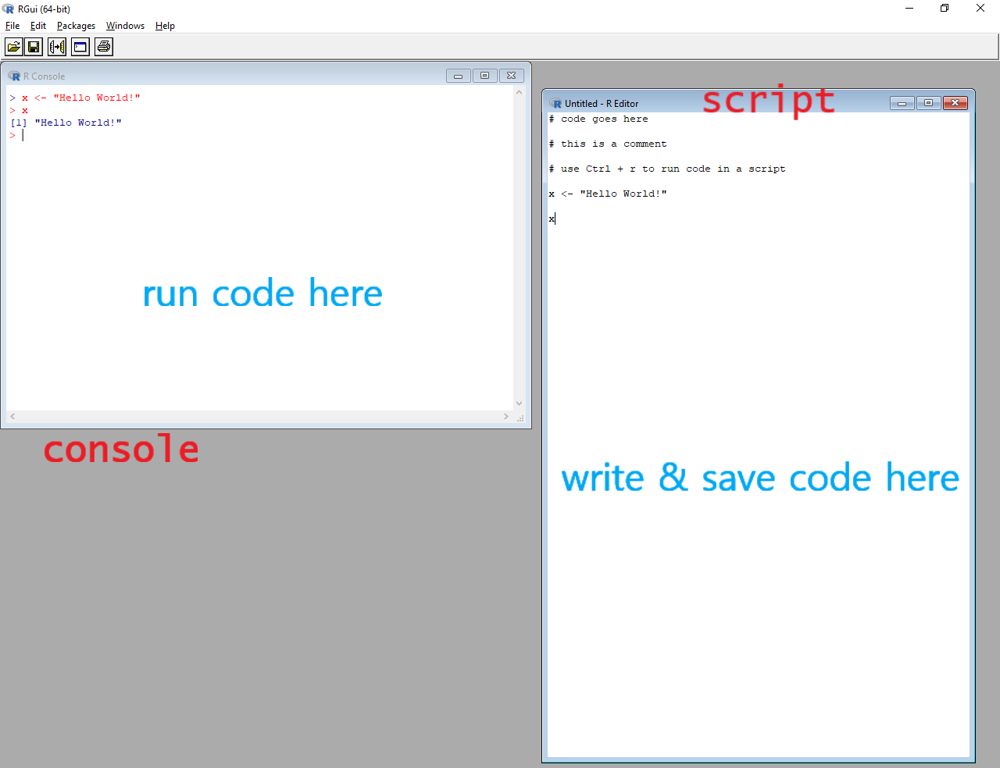

```{r setup, include=FALSE}
options(htmltools.dir.version = FALSE)
knitr::opts_chunk$set(echo = TRUE, fig.align = "center")
```

```{r xaringan-themer, include = FALSE}
library(xaringanthemer)
mono_light(
  base_color = "#072b50",
  text_color = "#444a5a",
  header_font_google = google_font("PT Serif"),
  text_font_google   = google_font("Roboto", "300", "300i"),
  code_font_google   = google_font("Droid Mono"), 
  link_color = "#0288ee"
)
```

```{r to_compile_slides, echo = FALSE, eval = FALSE}
# to build the slide deck, run these lines first: 
install.packages(c("knitr", "rmarkdown", "devtools"))
devtools::install_github('yihui/xaringan')
devtools::install_github("gadenbuie/xaringanthemer")
# then click "Knit" or type Ctrl + Shift + K or Cmd + Shift +K
```

# Outline 

1. Using R: R GUI, Terminal, RStudio IDE
2. R Data Types & Structures
3. Functions & loops
4. Reading data into R 
5. Libraries 

---
class: inverse, middle, center
# Using R 

---
# R Gui 

```{r r_gui, echo=FALSE}

```

---
# Terminal 

TBD 

---
# RStudio

```{r rstudio, echo=FALSE}
knitr::include_graphics("https://raw.githubusercontent.com/CSAFE-ISU/reu18/master/static/slides/rstats/img/rstudio4panes.png")
```

---
# RStudio

1. Source - these are scripts & other files. You edit them here. You can run code with Ctrl + Enter.
2. Console - where R "lives." Code is executed here. The results also print out here.
3. Environment and others

    a. Environment: shows what variables and values you have stored in your R session. 
    
    b. History: shows all code you've run in the console in the session
4. Files, Plots, Help, and others

    a. Files: shows & navigates through files on your computer. 
    
    b. Plots: shows you any plot that you've created in R. (Note: it does NOT save the plot)
    
    c. Packages: lists packages you have installed & are using
    
    d. Help: search for functions, topics, etc. to get help


---
# The R Console

```{r console, echo=FALSE}
knitr::include_graphics("https://raw.githubusercontent.com/CSAFE-ISU/reu18/master/static/slides/rstats/img/rprompt.png")
```


---
# Types of files to know

- **.R**: R scripts. R code is written & saved here.  
- **.Rmd**: RMarkdown document. Combines R code & Markdown to author reproducible documents
- **.csv**: Comma Separated Values. A simpler version of an Excel file. Very easy to read .csv data into R. (`read.csv()`)
- **.txt**: Text files. Can also be read into R very easily (`readLines()`, `read.delim()`)

---
class: inverse, middle, center
# R Data Types & Structures

---
# Basic Data Classes 

Numeric - numbers. Can also distinguish between integers and doubles.

```{r num}
x <- 1L
y <- 1.5
typeof(x); typeof(y)
```

---
# Basic Data Classes 

Character - strings

```{r char}
x <- "Hello darkness my old friend"
y <- "1"
typeof(x); typeof(y)
```

---
# Basic Data Classes

Logical - `TRUE` or `FALSE` (also `T` or `F` for short)

```{r logic}
x <- TRUE
y <- FALSE
z <- F
typeof(x); typeof(y); typeof(z)
```

---
# Data Structures: Vectors

Most vectors are atomic vectors: create with `c()`

```{r vecs}
# integer 
c(1L, 2L, 3L)
# numeric 
c(pi, exp(1), 1)
# character
c("Hello", "darkness", "my old", "friend")
# factor - categories 
as.factor(c("A", "B", "B", "A", "B"))
```


---
# Vectors `r emo::ji("warning")`

Warning! Only 1 type of data allowed in vectors! 

```{r one_type}
# what happens when we try to combine character & number? 
c("Hello", 3.14)
# what happens when we try to combine character & logical? 
c("Hello", F)
# what happens when we try to combine logical & number? 
c(T, 3.14)
```

---
# Data structures: Matrices

A matrix is made up of vectors. All matrix entries must be of the same type. 

```{r matrix}
# matrix of integers
matrix(1:10, nrow = 2)
# matrix of numerics
matrix(rnorm(10), nrow = 2)
# matrix of characters 
matrix(LETTERS[1:10], nrow = 2)
```


List 

matrix

data frame 

---
class: inverse, middle, center
# Functions & loops 

---
class: inverse, middle, center
# Reading data into R 

---
class: inverse, middle, center
# Libraries 