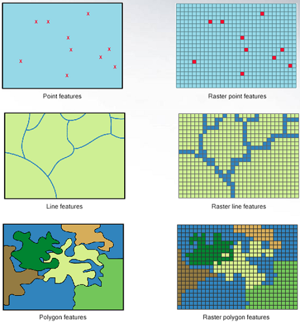

```{r setup, include=FALSE}
knitr::opts_chunk$set(echo = TRUE, fig.align = "center", warning = FALSE, fig.height = 3)
```

```{r xaringan-themer, include = FALSE}
# The following borrowed from Sam's code
library(xaringanthemer)
mono_light(
  base_color = "#800000",
  white_color = lighten_color("#EEEEEE", 0.9),
  text_color = "#444a5a",
  header_font_google = google_font("Roboto"),
  text_font_google   = google_font("Roboto", "400", "400i"),
  code_font_google   = google_font("Droid Mono"), 
  link_color = "#0288ee",
  outfile = "2020-01-21/xaringan-themer.css"
)
```

```{r to_compile_slides, echo = FALSE, eval = FALSE}
# to build the slide deck, run these lines first: 
install.packages(c("knitr", "rmarkdown", "devtools"))
devtools::install_github('yihui/xaringan')
devtools::install_github("gadenbuie/xaringanthemer")
# then click "Knit" or type Ctrl + Shift + K or Cmd + Shift +K
```

# Outline 

0. What Is Spatial Data?
1. Reading/Writing Spatial Data
2. Spatial Data Visualization
3. Spatial Data Transformation / Geoprocessing (if time)

---
class: inverse, middle, center

# What is Spatial Data?

---
## Vector vs. Raster Data

Spatial data comes in two main formats: **vector** and **raster** data.

Vector data often represents discrete objects, while 
raster data often represents continuous surfaces.

```{r echo=FALSE, out.width="30%"}

```

---
## Vector Data: Geocoding 

Sometimes people give me a list of addresses and ask me to map it. I can't do that unless I have the **latitude and longitude**, so I'll need to [**geocode**](https://cengel.github.io/rspatial/5_Geocoding.nb.html) the addresses. For states (polygons), I'll need to find a **geospatial boundary file** with that information (Google around!)

```{r}
bikeshare_addresses <- read.csv("data/bike_addresses.csv")
head(bikeshare_addresses)
```

---
## Geocoding in R

There are a few options, which usually limit you to 2000 queries. Here's one nice one that uses [OpenStreetMap](https://www.openstreetmap.org/).

```{r}
tmaptools::geocode_OSM("McLean Metro")
```

---
## Geocoding will give me latitude and longitude for points

```{r}
bikeshare_latlon <- read.csv("data/bike_addresses_latlon.csv")
bikeshare_latlon
```


--- 
class: inverse, middle, center

# Reading/Writing Spatial Data

--- 
## Read in spatial data

To read in spatial data, use the `st_read()` or `read_sf()` function from the `sf` package:

```{r}
library(sf)

st_read("data/dc_wards.shp") 
read_sf("data/dc_wards.shp") # if you like tidy data
# Also reads URLs, try the same function with https://opendata.arcgis.com/datasets/a1f7acf65795451d89f0a38565a975b3_5.geojson
```

--- 
## Take a look at the data structures

```{r}
dc_wards <- read_sf("data/dc_wards.shp")
dc_wards
```

---
## Writing spatial data

To write spatial data, use `st_write()` or `write_sf()`: 

```{r eval=FALSE}
st_write(dc_wards, "data-output/dc_wards.shp")
write_sf(dc_wards, "data-output/dc_wards.shp")
```

---
class: inverse, middle, center

# Spatial Data Visualization

---
class: inverse

# Spatial Data Visualization

- Base plotting
- tmap
- ggplot2
- mapview

---
## Base Plotting

```{r}
plot(dc_wards)
```

---
## Plot just the geometry

```{r}
plot(st_geometry(dc_wards))
```

---
## Plot more than one layer

```{r}
bikeshare_locations <- read_sf("data/bikeshare_locations.shp")
```

```{r}
plot(st_geometry(dc_wards))
plot(st_geometry(bikeshare_locations), add = TRUE)
```

---
## Common issues: Projections and Coordinate Reference Systems

If your map layers won't plot on top of each other, you need to check that they 
are in the same map projection.

```{r echo=FALSE}
dc_wards_proj <- st_transform(dc_wards, 6654)
```

```{r}
plot(dc_wards_proj)
plot(bikeshare_locations, add = TRUE)
```

---
## Check the projection

```{r}
st_crs(dc_wards_proj)
st_crs(bikeshare_locations)
st_transform(bikeshare_locations, st_crs(dc_wards_proj))
```

---
## Change the color 

```{r}
plot(st_geometry(dc_wards))
plot(st_geometry(bikeshare_locations), add = TRUE, col = "red", pch = )
```

---
## Other options

```{r}
library(tmap)
qtm(dc_wards)
```

---
```{r}
tm_shape(dc_wards) +
  tm_polygons()
```

---
```{r}
tm_shape(dc_wards) +
  tm_borders()
```

---
```{r}
tm_shape(dc_wards) +
  tm_fill()
```

---
## Change to an interactive mode

```{r}
tmap_mode("view")

tm_shape(dc_wards) +
  tm_polygons()
```

---
## Change back to static mapping, and add a layer
```{r}
tmap_mode("plot")

tm_shape(dc_wards) +
  tm_polygons() +
  tm_shape(bikeshare_locations) +
  tm_dots(size = 0.1)

```

---
## Much more complicated maps possible

```{r}
tmap_mode("plot")

tm_shape(dc_wards) +
  tm_polygons() +
  tm_shape(bikeshare_locations) +
  tm_dots(size = 0.1)

```

---
## ggplot2 is also an option

More on this at "[Drawing beautiful maps programmatically with R, sf and ggplot2](https://www.r-spatial.org/r/2018/10/25/ggplot2-sf.html)".

```{r}
library(ggplot2)
ggplot(data = dc_wards) +
  geom_sf()
```

---
## tmap is great with rasters though

```{r}

```

---
## For an interactive map experience similar to a GIS, check out mapview

```{r}
library(mapview)
mapview(dc_wards) +
  mapview(bikeshare_locations)
```

---
class: inverse

# Spatial Data Transformation / Geoprocessing

1. Crop locations to DC Wards
2. Count how many in each ward
3. Calculate bikeshare density by population

---
## Crop locations to DC Wards

```{r}
st_intersection(bikeshare_locations, dc_wards)
```

---
## Different from the following...

```{r}
st_intersection(dc_wards, bikeshare_locations)
```

---
## Count up number of bikes in wards

Two ways to do this...

1. Attribute join

```{r}
st_intersection(dc_wards, bikeshare_locations) %>% 
  dplyr::count(WARD) %>% 
  st_drop_geometry() %>% 
  dplyr::right_join(dc_wards)
```

---
## Count up number of bikes in wards

Less steps -

2. Spatial join (use the geometry to perform a join):

```{r}
st_join(dc_wards, bikeshare_locations) %>% 
  dplyr::count(WARD)
```

---
## Find bike density in each ward

```{r}
st_join(dc_wards, bikeshare_locations) %>% 
  dplyr::count(WARD, POP_2011_2)
```

```{r}
st_join(dc_wards, bikeshare_locations) %>% 
  dplyr::count(WARD, POP_2011_2) %>% 
  dplyr::mutate(bikeshare_density = n / POP_2011_2)
```

---
## Make a map!

```{r}
bikeshare_density_per_ward <- 
st_join(dc_wards, bikeshare_locations) %>% 
  dplyr::count(WARD, POP_2011_2) %>% 
  dplyr::mutate(bikeshare_density = n / POP_2011_2)

tm_shape(bikeshare_density_per_ward) +
  tm_polygons("n")
```

---
# Resources

- [Tutorials developed by my research center](https://spatialanalysis.github.io/tutorials/)
- [Geocomputation with R](https://geocompr.robinlovelace.net/)
- [Spatial Data Science](https://keen-swartz-3146c4.netlify.com/)
- [Data Carpentry Geospatial Lesson](https://datacarpentry.org/r-raster-vector-geospatial/) (focuses on raster data)
